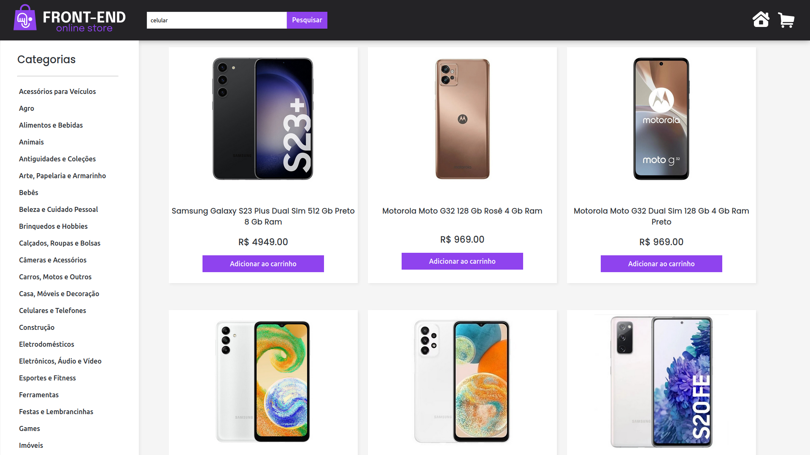

# Front-end Online Store - Mercado Livre API





## [Live Demo](https://frontend-online-store-33.surge.sh)


> Front-end Online Store is a e-commerce where you can buy anything you want!

- React with Typescript project inspired by Mercado Libre online marketplace.
- Search, add to cart and buy anything you want, fetched from the Mercado Livre API.
- Multiple Routes using React Router.
- Made in group using agile methodologies and pair programming.
- Full live preview deployed on Surge: [Front-end Online Store](https://frontend-online-store-33.surge.sh)

## Installing and running

```
git clone git@github.com:gabrielmoisesa/frontend-online-store.git
cd frontend-online-store
npm install
npm run dev
```

## Technologies/Tools

- React
- Typescript
- CSS3
- Figma
- Git & GitHub (Developed in [Trybe Organization](https://github.com/tryber))
- Trello

## Authors

<table>
  <tr>
    <td align="center">
      <a href="#">
        <br>
        <sub>
          <a href="https://github.com/gabrielmoisesa">Gabriel Moises Alves</a>
        </sub>
      </a>
    </td>
    <td align="center">
      <a href="#">
        <br>
        <sub>
          <a href="https://github.com/mrlazarias">Murilo Azarias</a>
        </sub>
      </a>
    </td>
    <td align="center">
      <a href="#">
        <br>
        <sub>
          <a href="https://github.com/lucasribeiro97">Lucas Ribeiro</a>
        </sub>
      </a>
    </td>
    <td align="center">
      <a href="#">
        <br>
        <sub>
          <a href="https://github.com/Cicchelli">Stephan Cicchelli</a>
        </sub>
      </a>
    </td>
    <td align="center">
      <a href="#">
        <br>
        <sub>
          <a href="https://github.com/NaltherGanemDev">Nalther Ganem</a>
        </sub>
      </a>
    </td>
  </tr>
</table>

## License

This project is under [MIT LICENSE](LICENSE).

